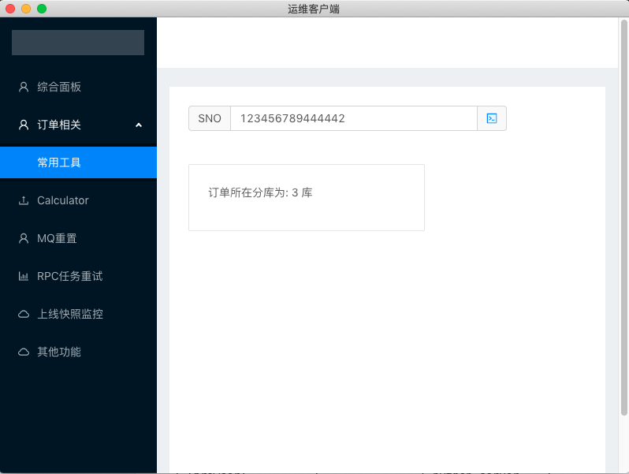

## 起因

观察部门业务,抽空开发的自动化运维工具,包括py脚本和一些小工具。

因为没服务器,所以调研了一下,想做个跨平台的客户端.

electron可以自由选择前端的技术,考虑生态,选择了react.

后台语言方面,从脚本和效率方面考虑选了python.

通信方面因为http效率比较低,使用了rpc.

## 效果

因为运维脚本与公司业务强耦合,无法公布,这里只是给出一套react-antd-electron-python-demo的demo工程




## 架构

```
start
 |
 V
+--------------------+
|                    | start
|  electron          +-------------> +------------------+
|                    | sub process   |                  |
| (browser)          |               | python server    |
|                    |               |                  |
| (all html/css/js)  |               | (business logic) |
|                    |   zerorpc     |                  |
| (node.js runtime,  | <-----------> | (zeromq server)  |
|  zeromq client)    | communication |                  |
|                    |               |                  |
+--------------------+               +------------------+
```


## 技术选型

- [Create React App](https://github.com/facebook/create-react-app).      
  react app脚手架     

- craco-antd(craco)
  **C**reate **R**eact **A**pp **C**onfiguration **O**verride is an easy and comprehensible configuration layer for create-react-app.
  解决CRA脚手架覆盖配置的问题.     
  这是antd的集成版      
  https://github.com/sharegate/craco

- antd(开源的前端组建库)

- zerorpc     
  python的rpc通信库,基于zeromq。它同时支持python和nodejs             
  https://gist.github.com/ninehills/5804894
  

## 其他

为了便于调试,我们需要concurrently和wait-on这两个库,先启动python服务端,再在electron中连接端口.  


## 使用

安装依赖
```shell
yarn install
```

编译zeromq
```
npm install electron-rebuild && ./node_modules/.bin/electron-rebuild
```

启动项目

```shell
yarn start-con
```

